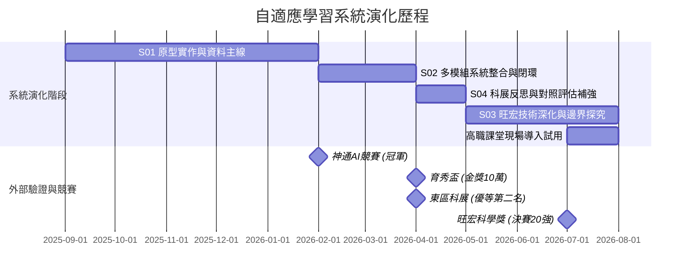

# 陽甫百川自傳與讀書計畫故事母稿 (Story Master)

> **文件定位**：本文件為葉陽甫申請國立陽明交通大學百川學士學位學程之「自傳與讀書計畫核心故事母稿」。本稿旨在完整保存、系統整理陽甫的個人故事、發展歷程、技術演化、角色分工、學業數據與研究定位。所有後續撰寫之手寫自傳（1000字）、學習計畫（A4三頁）及面試問答稿，皆應以本檔記載之事實與敘事主軸為權威依據。

---

## 1. 文件定位與使用方式

本文件是全套申請資料的「故事心臟與敘事母庫」。在備審資料三層架構中，本檔為第一層核心文件（手寫自傳與學習計畫）提供完整的敘事骨架、情節細節與事實依據。

* **備審資料分工原則**：
  * **第一層（手寫自傳、學習計畫）**：回答「我是誰、如何成為現在的我」以及「為何選擇百川、未來四年如何透過跨域學習解決未竟問題」。自傳聚焦於人格特質、轉譯能力與研究轉折；學習計畫聚焦於未完成的研究課題與百川課程地圖的實質對接。
    - **自傳文字母版**：✅ **998 字定稿版已完成**（見 `04_autobiography_1000.md`）。
    - **正式手寫提交版**：⏳ **待謄寫／最後檢查**（黑/藍筆手寫於 A4 紙張後掃描 PDF）。
    - **學習計畫**：⏳ **待撰寫（高優先 Pending）**（A4 三頁內修課藍圖；首選方向：人工智慧－工程與科學組，尚待最終確認）。
  * **第二層（人物能力補充資料 T00, T01, A01, A02, P01, P02, S01~S04, L01）**：作為具體的故事型佐證文件。
    - **重要規範**：正式交付之 PDF 頁面一律使用內容型名稱作為頁尾，**絕對不印內部工作代碼（T00/A01/S01 等）**。
  * **第三層（原始證明）**：保留獎狀、成績單、檢定證書等原始檔案。
* **團隊與作者使用說明**：
  * 本文件依目前可取得之正式證明、原始資料與已確認分工建立；仍待核實之項目均另以 `[待確認]` 或 `[待確認官方引用]` 標示。
  * 讀懂本文件即可獲取全專案完整且一致之口徑。

---

## 2. 一句話總母題

> **爸爸從高職數學教室提出問題，陽甫與團隊把問題帶進 AI 研究與競賽，再把經過驗證與修正的系統帶回原來的教室；百川要承接的，就是這項尚未完成的跨域工作。**

---

## 3. 完整故事總覽

葉陽甫的故事，並非一個天才高中生在實驗室裡憑空發明 AI 系統並一路順風順水斬獲大獎的傳奇，而是一個關於「轉譯、實作、面對不足、科學修正與回歸現場」的真實探究歷程。

故事起源於花蓮高商的數學教室。陽甫的父親作為第一線高職數學教師，長期面臨學生先備知識缺口巨大、個別差異顯著，以及教師無法在有限課堂時間內逐一進行精準診斷與適性補救的困境。父親提出了系統的功能需求、教學邏輯、教材分類與 AI 輔助出題的方向。陽甫的核心價值，在於他扮演了「跨域轉譯者」的角色——與團隊成員合作，將父親從真實教學現場觀察到的痛點與教學語言，一步步轉化為系統架構、演算法模組、確定性修復機制與可以實際運作的研究原型。

從早期的神通 AI 數位學院扶輪盃冠軍（S01 實作原型資料主線）、第 23 屆育秀盃創意獎 AI/資訊類金獎（S02 多模組系統整合），到第 66 屆東區科展優等第二名（S04 反思修正歷史頁），再到第 25 屆旺宏科學獎全國 20 強（S03 深化研究），陽甫與團隊所展示的並非四個獨立的競賽作品，而是同一套自適應學習系統在不同階段接受檢驗與持續演化的歷程。

東區科展是整條研究軌跡最重要的轉折點。當時作品雖然具備完整的實作功能，卻因整合過多子系統而導致研究焦點模糊、驗證方法不足。陽甫與團隊沒有將結果歸因於評審，而是坦然接受研究表達與驗證上的缺口。他們回頭重新界定研究問題、補強 AB1/AB2/AB3 對照實驗與既有 MCRI 量化評估，並針對模型出題易產生程式錯誤的風險，深入探究確定性修復工具（AST Active Healer）的能力邊界與棄權機制，最終將作品推向旺宏科學獎全領域全國決賽 20 強。

競賽與獲獎從不是終點。目前，陽甫正協助父親將這套經歷競賽檢驗與研究修正的系統，重新導入花蓮高商的高職數學課堂。這項歷程構成了一個完整的閉環：**真實現場提出需求 $\to$ 技術實作與轉譯 $\to$ 競賽與研究檢驗 $\to$ 發現缺口並實驗修正 $\to$ 重新回歸教學現場**。

在研究之外，陽甫長期投入五人制足球訓練（P01 長期投入），率隊勇奪全國聯賽第五名與第六名，展現了強大的紀律、團隊合作與抗壓韌性；因足球分析自學 Python 爬蟲與資料分析（P02 主動探索）；在面對課業壓力與高強度研究並行時，展現了大幅提升學科成績的自主管理能力（A01 自律管理）；在微控制器控制中展現問題拆解實作力（A02 問題拆解）；而優異的語文能力（L01 拓展世界），則讓他在跨領域溝通、技術轉譯與論文閱讀中遊刃有餘。

如今，這套系統正處於教室導入與準備試用的關鍵階段。陽甫清楚看見，研究原型距離真正可靠、可驗證且能被教師長期採用的教育工具，仍有許多跨越資訊科學、學習科學與人機互動的深刻問題尚未解決。這正是他選擇申請陽明交通大學百川學士學位學程的核心動力。

---

## 3.1 文武兼備的起點——國中階段的四條併行路徑（T00 核心敘事）

> **111 學年度班級模範生導師評語**：  
> 「**品學兼優，文武兼備，參加校外發明展、科技競賽、英語文、數學及足球競賽成績優異。**」

這句導師評語，精準概括了陽甫國中時期的探索底色，並作為回看國中四條發展路徑的總結與起點。

T00 不只是國中成果的整理清單，其在整體備審中的核心功能，是**證明高中階段的 AI、工程、英文、數理與足球表現，並非高三特殊選才前夕才突然出現，而是早在國中時期便已有前導累積與長期探索脈絡**。

### 四條核心主線與敘事邏輯：

1. **足球主線**：
   - 111 學年度國男乙級全國第三名（季軍戰正規賽 1:1，PK 5:4 擊敗臺中安和國中，葉陽甫於 PK 大戰中冷靜踢進關鍵決勝球）。
   - 國三挑戰甲級聯賽並擔任隊長。
   - **核心反思**：「**卓越不只是站在最頂端，也包含和夥伴一起合作、卡關、把事情做成。**」這種在球場上淬鍊出的團隊合作態度與抗挫力，後續深刻延伸到高中科展與 AI 研究團隊。
   - **影音佐證**：[PK 決勝慶祝影片](https://youtu.be/Lqmus0enZTo)。

2. **工程實作主線（智慧遮雨棚）**：
   - 國二與兩位同學組隊，從生活問題出發（陽台曬衣遇雨淋濕、長者曝曬安全、植栽積水）。
   - 使用 MIT App Inventor + Arduino，整合雨滴、溫溼度、超音波感測器與伺服馬達驅動。
   - 設計「曬衣模式」、「看護模式」、「花園模式」三種情境，並保留手機端與實體手動控制功能。
   - 榮獲 **2022 花蓮縣發明展佳作** 與 **2023 IEYI 臺灣選拔賽 國中組便利生活類銀獎**。
   - **核心意義**：第一次深刻體會到作品從「堪用」到「被更高標準認可」，需要經歷持續的修改、測試與優化。
   - **佐證連結**：[完整專案簡報](https://bit.ly/yangfu-invention) ｜ [作品介紹影片](https://youtu.be/tIS7Ye32mts)。

3. **英語表達主線**：
   - **花蓮縣112年度學生英語動態競賽英語讀者劇場 國中組特優**（與同學共同排練、角色分工、肢體動作與舞台演出）。
   - 國三花蓮縣英語文閱讀能力競賽**英文作文優等**。
   - **核心意義**：體會「**英文不只是考試科目，而是表達與合作工具**」，後續直接延伸為高中公開報告、科展簡報答辯與技術說明能力。
   - **影音佐證**：[讀者劇場演出影片](https://youtu.be/vFI9dCn-TRc)。

4. **數理基礎主線**：
   - **2022 更生日報盃數學大賽**：國中二年級組**銀牌**。
   - **2023 JHMC 國中數學競賽花蓮區示範賽**：**個人優良獎**、**團體一等獎**。
   - **核心意義**：更生盃偏個人計算與推理穩定度；JHMC 同時考驗個人實力與團隊協同解題表現。從中領悟到：「**數學能力可以是個人的，但把一件事做成往往是群體的。**」

### 國中階段其他佐證（輔助佐證，不升格為主線）：
- **全民英檢（GEPT）中級通過**：達 CEFR B1+ 等級，聽、說、讀、寫四項皆通過。
- **111 學年度班級模範生**：獲選班級模範生。
- **111 學年度校運會 800 公尺第一名**：成績 2'37"28。

> **頁尾導引**：「這四條路徑，在高中階段持續展開——請見 T01 成長軌跡。」

---

## 4. 故事起點：爸爸的高職數學教室

這套自適應學習系統的誕生，完全源自於真實教學現場的困境與觀察，絕非為了參加科學競賽而臨時虛構的題目。

故事的最初起點，來自陽甫的父親。父親任教於國立花蓮高級商業職業學校（花蓮高商），擔任第一線數學教師。在高職教學現場，教師們面臨著極為棘手的教學痛點：
1. **先備知識缺口極大**：高職學生的國中數學基礎差異懸殊，許多學生在學習高二或高三主題時，卡住他們的往往不是當前的公式，而是國中甚至國小的基本代數或幾何概念缺口。
2. **課堂診斷資源有限**：在一堂 50 分鐘、面對 30 到 40 位學生的課堂中，教師難以實時診斷每一位學生的具體知識缺口，更無法為不同程度的學生即時提供個人化的提示與補救教材。
3. **傳統評量無法適性補救**：傳統的紙筆測驗只能產出分數，無法自動化地追蹤學生的認知歷程與作答脈絡。

面對這些困境，父親結合多年教學經驗，逐步構想出一套高職數學自適應學習系統的藍圖，包括功能需求、操作流程、教材分類與 AI 輔助出題方向。

---

## 5. 從教師需求轉化為技術系統（跨域轉譯定位）

父親提出了教學現場的問題與系統構想，但如何將這些抽象的教學需求，落實為可以運作的程式碼與演算法，則是陽甫與團隊所承擔的核心任務。

**陽甫在百川申請中的獨特價值定位**：  
陽甫的核心優勢，**絕非宣稱自己一個人獨立完成了所有的頂尖演算法**，而是他具備了罕見的**跨域轉譯與系統整合能力**——能夠在「第一線教師需求」、「高中職數學教育」、「軟體工程系統」與「AI 演算法模組」之間進行深入理解、雙向轉譯、模組實作與流程整合。

在專案開發過程中，陽甫與團隊推動了以下轉譯工作：
1. **需求語言轉化為系統架構**：將父親描述的「教師希望能看到學生哪裡不會」，轉化為前端數據庫設計、知識圖譜結構與學生知識狀態模型。
2. **教學分類轉化為數據結構**：將高職數學教材的章節與題型，設計成可供 RAG 檢索與分類標籤化的 JSON Schema。
3. **AI 介入方向轉化為工程模組**：將「AI 輔助出題」的想法，拆解為 Prompt Engineering、AST 語法樹解析、程式執行驗證與確定性修復機制。
4. **教學介面轉化為互動 UX**：設計出適合高職學生操作的作答介面，以及便於教師檢視班級學習歷程的數據儀表板。

---

## 6. 角色分工與團隊貢獻界線

為確保整份備審資料與面試答詢之嚴謹度與真實性，必須明確界定專案中各角色的貢獻與權責，絕不誇大：

| 角色 | 身份／單位 | 實際貢獻與權責 | 正確敘述方式 | 嚴格禁止之錯誤敘述 |
| :--- | :--- | :--- | :--- | :--- |
| **爸爸** | 花蓮高商數學教師 | 提出原始教學痛點、功能需求、頁面構想、教材與題型分類架構、AI介入方向；現階段提供高職教材與課堂場域。 | 原始教學需求提出者、第一位教師使用者、教學顧問。 | **絕對不可**寫成科展或旺宏科學獎之正式指導老師。 |
| **葉陽甫** | 花蓮高中學生（申請人） | 主導 Prompt Engineering / AST Healer 核心研究；負責整條資料主線（S01）；負責多模組系統整合（S02）；負責科展答辯與現場部署。 | Prompt / AST Healer 研究主軸、系統架構設計、核心模組實作與系統整合負責人。 | **絕對不可**將 PPO 或 Hybrid RAG 核心演算法寫成葉陽甫個人研究成果；不可宣稱一人獨力完成所有研發。 |
| **蔡昕諾** | 團隊成員 | 主導 **PPO 多目標推薦演算法** 研究與實作。 | PPO 多目標推薦研究主作者、共同研發成員。 | **絕對不可**淡化隊友之演算法獨立貢獻（陳昕諾為媒體誤植之舊資料）。 |
| **林昕佑** | 團隊成員 | 主導 **Hybrid RAG 教材檢索與補救機制** 研究與實作。 | Hybrid RAG 檢索研究主作者、共同研發成員。 | **絕對不可**淡化隊友之 RAG 獨立貢獻。 |
| **趙義雄老師** | 花蓮高中教師 | 指導東區科展與旺宏科學獎之研究方法、論文撰寫規範、實驗設計與科學表達。 | 東區科展與旺宏科學獎之**正式研究指導老師**。 | **絕對不可**由爸爸取代趙義雄老師之指導老師地位。 |

---

## 7. 同一套系統的演化時間軸與競賽歷程

陽甫與團隊所獲得的各項競賽榮譽，絕非四個互不相干的獨立作品，而是同一套自適應學習系統從「原型實作」走向「多模組整合」，再歷經「科展反思修正」與「旺宏深化研究」的成長歷程：

---

## 8. S01 神通 AI 扶輪盃：原型實作與資料主線

* **狀態**：✅ **兩頁版定稿**
* **人格／能力標籤**：**實作協作**
* **競賽成果**：2026 神通 AI 數位學院扶輪盃高中 AI 競賽高中組第一名（冠軍）。獎金額度標記 `[待確認]`。
* **核心定位**：把適性化學習構想做成可運作的 AI 系統原型。
* **葉陽甫角色**：負責**從教材進入系統，到學生作答回傳的整條資料主線**。
* **四個主要區塊**：
  1. **資料庫規劃**：建立知識點、題目屬性與作答歷程之關聯架構。
  2. **教材自動化匯入**：設計結構化匯入管線。
  3. **Code-as-Content**：利用程式生成題目與動態參數。在此階段**發現 AI 生成程式碼的可靠度與語法報錯問題**，成為後續 AST Healer 研究的起點。
  4. **多模態作答 × 蘇格拉底 AI 助教**：提供分層引導而非直接給答案。
* **主線邏輯**：**教材進得來 $\to$ 題目生得出 $\to$ 學生寫得下 $\to$ 系統看得懂**。
* **第二頁**：**外部驗證｜競賽證明與公開報導**。

---

## 9. S02 育秀盃創意獎：多模組整合與完整閉環

* **狀態**：✅ **兩頁版定稿**
* **人格／能力標籤**：**系統整合**
* **競賽成果**：第 23 屆育秀盃創意獎高中職 AI 應用類金獎（**100,000 元獎學金**）。
* **與 S01 的關係**：不是另一套獨立作品，而是同一套自適應學習系統的深化——**從原型實作 $\to$ 多模組整合 $\to$ 完整學習閉環**。
* **三個功能層架構**：
  - **Brain**：PPO 自適應導航（蔡昕諾研究主作者）
  - **Hands**：Code-as-Content 程式出題（葉陽甫研究主軸）
  - **Mouth**：Hybrid RAG 觀念補救（林昕佑研究主作者）
* **閉環流程**：  
  $$\text{學生作答} \longrightarrow \text{Local APR 更新} \longrightarrow \text{PPO 決策} \longrightarrow \text{Code 產題 / RAG 補救} \longrightarrow \text{蘇格拉底式引導} \longrightarrow \text{再作答} \longrightarrow \text{掌握後返回主線}$$
* **葉陽甫角色**：理解各模組 input / output / state，將題目生成、學習狀態、routing、跨單元補救與多模態作答介面整合成學生可實際操作的前端學習流程。
* **第二頁**：**外部驗證｜競賽證明與公開報導**。

---

## 10. S04 科展研究歷程：反思修正與研究演進歷史頁

* **狀態**：✅ **兩頁版定稿**
* **人格／能力標籤**：**反思修正**
* **正式定位**：**反思修正／研究演進歷史頁**（非單純獲獎展示頁）。
* **主標**：**從東區科展未晉級，到旺宏科學獎全領域 20 強**。
* **核心歷程**：  
  $$\text{校內科展優勝} \longrightarrow \text{東區科展優等（東區第二名，未晉級全國）} \longrightarrow \text{重新檢查研究} \longrightarrow \text{重新聚焦} \longrightarrow \text{補強驗證} \longrightarrow \text{旺宏決賽 20 強}$$
* **東區科展暴露的問題**：
  1. 研究焦點過於分散（包山包海）
  2. 技術關係沒有說清楚
  3. 驗證證據仍不完整
* **修正作為**：
  1. 重新聚焦研究問題
  2. 補強 AB1 / AB2 / AB3 對照實驗
  3. **補強／重新整理既有 MCRI 評估**（*注：MCRI 在科展前已存在，禁止寫「科展後建立 MCRI」*）
  4. 加入統計分析
  5. 重整圖表與研究敘事

---

## 11. S03 旺宏科學獎／AST Healer 深化研究

* **狀態**：⏳ **尚待完成／待決賽結果 (Pending)**（本輪不製作頁面內容）
* **人格／能力標籤**：**標籤暫定／待頁面設計後確認**（暫定：科學探究）
* **功能定位**：AST Healer 真正技術深化與旺宏後續研究成果的核心頁。
* **分工對比**：
  - **S04** 回答：「我們如何從研究失利中反思與修正？」
  - **S03** 回答：「AST Healer 到底能修什麼、不能修什麼？如何公平驗證？」
* **核心技術內容**：
  - Prompt / Scaffold
  - Deterministic Repair（確定性語法與介面契約修復）
  - AST Active Healer 架構
  - Repair Boundary（修復能力邊界）
  - **Abstention Mechanism（棄權機制）**：超出確定性範疇時主動拒絕修復，防止錯修
  - Error Taxonomy（錯誤分類體系）
  - Benchmark、Pass / Fail 檢驗、Rescue Rate（修復率）、Regression（回歸分析）
  - External Validation 與 Statistical Validation
* **研究方法演進（核心重要敘事）**：
  - **第一階段**：以 MCRI 作為主要量化評估工具。
  - **後續深化**：重新檢討自建指標的限制，逐步轉向標準基準測試（benchmark）、Pass/Fail、修復率與統計對照檢驗。
  - **敘事重點**：「**研究者不只檢查模型，也必須檢查自己的評估工具。**」
* **旺宏官方數據**：入圍全國決賽 20 強（編號 SA25-016；全領域 846 件、電腦資訊類 4 件進入決賽，數據標記 `[待確認官方引用]`）。**決賽結果尚未公布，嚴禁預寫獲獎**。

---

## 12. 系統重新回到高職課堂

競賽的榮譽與科學論文的發表，並非這套系統的最終終點。

目前正在進行的最重要工作，是將這套歷經無數次迭代、修改與科學驗證的自適應學習系統，**重新帶回最初提出問題的地方——爸爸的花蓮高商高職數學課堂**。

現階段的現場導入分工如下：
* **父親（教學端）**：持續提供高職數學各章節教材、單元能力指標、典型題型與課堂實際教學需求，並作為第一位教師使用者評估介面與歷程。
* **陽甫（技術端）**：協助將教材與題目結構化導入系統庫，進行系統部署、伺服器環境配置、效能調校，並親自教導教師操作儀表板。

這形成了一個完整的應用閉環：
$$\text{需求提出} \longrightarrow \text{技術實作} \longrightarrow \text{競賽檢驗} \longrightarrow \text{挫折反思} \longrightarrow \text{科學深化} \longrightarrow \text{回歸現場試用}$$

**嚴格標註**：目前為「正在進行教材導入、部署試用與教師端培訓」，**絕對不宣稱**已完成大規模教學實證或已證實顯著提升成績。

---

## 13. 百川學習計畫未解問題三大群組（供修課藍圖撰寫對接）

自適應學習系統在花蓮高商試用中浮現出的深層課題，歸納為三大跨學科學門群組，作為後續撰寫《交大百川學習計畫｜A4三頁》之核心對接藍圖：

### 群組 A：Reliable AI 與資訊工程核心 (Reliable AI & Computer Science)
1. **AI 出題的正確性、可追溯性與課綱對齊**：消除數學邏輯幻覺，建立題目與課綱知識點之可追溯鏈條。
2. **Healer 的拒絕修復機制與自動邊界判定**：建立自適應「棄權演算法（Abstention Mechanism）」，防止錯修。
3. **系統高併發穩定性與數據隱私安全**：課堂多人即時測驗的高可用架構與學生數據去識別化安全加密。

### 群組 B：學習科學與教育數據探究 (Learning Sciences & Educational Data Mining)
4. **真實知識缺口辨識與追蹤**：結合認知診斷模型（CDM）與知識追蹤（Knowledge Tracing），從作答歷程精準診斷先備知識斷層。
5. **適性補救路徑的有效性實證**：個人化推薦補救相較於傳統刷題之學習保留率（Retention Rate）與遷移能力驗證。
6. **真實課堂情境的實證研究設計**：設計不干擾正常教學的教育實證 A/B Test 實驗。

### 群組 C：人機互動與人機協同 (HCI & Teacher-in-the-Loop)
7. **教師可解釋性與控制權（Teacher-in-the-Loop）**：提供教師對 AI 診斷結果進行覆核、修正與人機協同決策介面。
8. **引導式提示（Scaffolding Hints）與防洩漏平衡**：設計分層提示策略，引導學生思考而不直接透漏解答步驟。

---

## 14. 為什麼非百川不可（百川申請的核心定位）

**百川申請的核心定位**：  
陽甫**不是因為想讀資工系但分數不夠而把百川當作替代方案**。百川簡章明確指出：「*百川學士學位學程主要在於營造主動、多元、跨域、通才的學習環境，欲專精單一專業領域的同學，建議選擇其他專業科系。*」

陽甫之所以非百川不可，是因為他**帶著一套已經在花蓮高商執行兩年、同時橫跨「資訊工程、Reliable AI、數學教育、學習科學與人機互動」的真實未解課題進場**。這些問題在傳統單一資工系或教育系中都無法獨立獲得完整解答：
- **在資工與 AI 領域**：深化演算法、軟體工程、可解釋 AI 與 Reliable AI 理論。
- **在學習科學與教育領域**：選修認知心理學、教育數據探究（EDM）、教育統計與實證研究法。
- **在人機互動領域**：研究教師協同控制介面與人機協同決策設計。

百川不分系的彈性跨域架構，正是陽甫將高中研究原型打造成真正可靠、可解釋且具公信力之教育工具的最佳也是唯一舞台。

---

## 15. 足球所呈現的團隊、紀律與抗壓（P01 長期投入）

* **體育賽事成果**：
  - 113 學年度中等學校足球聯賽（5人制）高中男生組：全國第六名。
  - 114 學年度中等學校足球聯賽（5人制）高中男生組：**全國第五名**（5:3 擊敗惠文高中）。
* **人格底色與行為模式**：
  1. **極致的自律與時間管理**：普通班學生克服訓練時數差距，高效率切割作息。
  2. **長期的紀律與耐受度**：十年足球基本功訓練，轉化為程式除錯與實驗的耐力。
  3. **高壓環境下的快速決策**：五人制足球快節奏決策，支撐口試與答辯沉著心態。
  4. **隊友信任與分工承擔**：球場戰術配合對應到科研團隊分工。
  5. **面對落後的修正力**：「面對落後 $\to$ 分析不足 $\to$ 修正策略 $\to$ 再度挑戰」的強大抗挫韌性。

---

## 16. 課業調整與自主管理（A01 自律管理）

* **四學期班級排名**：3 → 3 → 5 → 3（四學期皆維持班級前五）
* **段考進步**：高二上第一次平均 78.56 (班排5/35, 年排40/339) $\to$ 第二次平均 84.44 (班排4/35, 年排19/339)
* **模考表現**：114-9月模考 45級分 (校排59/645) $\to$ 114-2月全國模考 48級分 (自然組 1/34、校排 10/325，數A 10 $\to$ 12級分)。
* **客觀規範**：標明母數差異，以總級分與數A實質進步證明多線並行下之自主管理彈性。

---

## 17. 語文能力與跨域轉譯（L01 拓展世界）

* **客觀成績**：GEPT 中高級聽讀與口說通過、校內演說第一名、作文第二名。
* **跨域價值**：無障礙閱讀英文 AI 論文與技術文件；具備對教師（教育語言）、對團隊（工程語言）、對評審（科學語言）的「跨域轉譯」溝通能力。

---

## 18. Arduino 實作與問題拆解（A02 問題拆解）

* **專案主題**：從程式到實體控制——Arduino 智慧節能防呆警報器。
* **核心能力**：Arduino Uno、感測器、伺服馬達、LED、蜂鳴器整合，掌握 input → logic → output 最小化單元測試與循序除錯（minimal test & gradual integration）。底層原始檔案標記 `[待補／待整理]`。

---

## 19. 系所版本策略 (Department Adaptation Strategy)

- **CS 系所**：強調 programming, algorithms, data structures, software engineering, testing, validation, debugging, system integration, version control, team collaboration。
- **EE 系所**：增加 Arduino, sensors, embedded systems, hardware/software integration, control, input-process-output, system debugging。
- **百川／不分系**：強調 教育問題 → 數學 → 程式 → AI → 自適應系統 → 研究驗證，以及足球、英文、實作所交織的跨域路徑。

---

## 20. 不可誇大或寫錯的事項（風控守則）

1. 父親為需求提出者，科展/旺宏正式指導老師為**趙義雄老師**。
2. 三人團隊合作（葉陽甫：Prompt/Healer+系統整合；蔡昕諾：PPO；林昕佑：Hybrid RAG），不將隊友演算法寫為陽甫個人成果。
3. 國一充電器為學長製作，陽甫僅協助想法與文件；國中遮雨棚為三人分工（木工蕭黃負責，陽甫負責 Arduino 與 App）。
4. 2023 IEYI 為臺灣選拔賽銀獎，非金牌，未參加世界賽。
5. 東區科展反思不怪評審；禁止寫東區科展後「建立 MCRI」（是補強既有評估）。
6. AST Healer 不可宣稱修復所有錯誤；強調棄權機制。
7. 花商試用不可宣稱大規模教學成效。
8. 旺宏 20 強決賽結果未公布，嚴禁預寫獲獎；846/20/4 標記 `[待確認官方引用]`。
9. 模考母數不同不可直接做排名等價比較。
10. 育秀盃金獎獎學金為 100,000 元整；神通 AI 冠軍獎金標記 `[待確認]`。
11. 正式備審 PDF 頁尾使用內容型名稱，**絕對不印內部工作代碼（T00/A01/S01 等）**。
