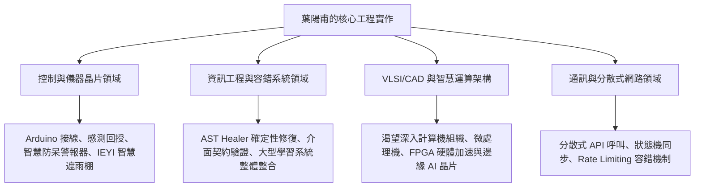

# 國立成功大學 電機系 特殊選才備審定位與面試策略

---

## 一、成大電機核心定位：從「系統整合」到「硬核工程」

> **成大電機特色**：成大工學院與電資學院歷史悠久、以**「踏實務實、工程底盤硬核、產學連結極深」**著稱。系所涵蓋九大領域（微電子、電子材料、控制、電力、VLSI/CAD、儀器系統與晶片、資訊工程、通訊網路、資安），重視**「跨領域軟硬體整合與系統最佳化」**。

### 1. 核心定位語（Elevator Pitch）
> **「陽甫不是單純的演算法使用者，而是具備問題拆解、系統容錯與軟硬體落地本能的年輕工程師。從國中 Arduino 感測控制、高中智慧防呆電路，到自主研發具確定性修復機制的 AST Healer 與大型自適應學習架構，陽甫深刻體認到智慧運算的終極瓶頸在於軟硬體界面；渴望在成大電機接受嚴謹的電路、訊號、微處理機與系統工程訓練，成為能駕馭邊緣智慧（Edge AI）與智慧計算硬體架構的跨域工程人才。」**

### 2. 與純資工（CS）及交大百川（跨域）的差異化訴求

| 申請校系 | 敘事核心焦點 | 技術關鍵字 | 避免踩雷方向 |
| :--- | :--- | :--- | :--- |
| **成大電機** (本系) | **工程實現、軟硬體界面、容錯控制、底層計算** | **Sensors, Arduino, Control, Hardware/Software Co-design, Fault-tolerance, Determinism, Embedded Systems** | ❌ 避免談過多抽象社會教育哲學<br>❌ 避免讓人誤以為只想寫純軟體、不想學電路物理 |
| **清交資工** | 軟體工程、編譯理論、演算法、資料結構 | AST, Algorithm, Software Architecture, Testing Benchmark, Code-as-Content | ❌ 避免過多硬體接線細節，專注在軟體架構與複雜度 |
| **交大百川** | 跨領域問題解決、教育科技實踐、文武兼備 | Educational AI, Adaptive Learning, PPO + RAG + Healer, Cross-disciplinary, Soccer | ❌ 避免過度偏向單一狹窄工科技術，強調跨界融合 |

---

## 二、成大電機九大領域的精確對接策略

成大電機系簡章特別指出系上劃分為九大領域。備審與面試中應針對下列 4~5 個關鍵領域建立清晰連結：



1. **控制領域 (Control) & 儀器系統與晶片 (Instrumentation & Chips)**：
   - 連結事實：國中 IEYI 智慧遮雨棚（雨水感測、馬達正反轉、藍牙通訊）；高中 Arduino 智慧防呆警報器（94 分高分、感測狀態機、閉迴路保護）。
   - 展現特質：對「輸入（感測）$\to$ 運算（邏輯判斷）$\to$ 輸出（致動保護）」的物理工程迴路具有直覺性理解。
2. **資訊工程領域 (Computer Engineering)**：
   - 連結事實：自適應助教系統之模組整合、Prompt Engineering、AST 語法樹解析與確定性代碼修復工具。
   - 展現特質：深刻理解軟體工程可靠度（Reliability）與棄權邊界（Abstention Mechanism）。
3. **VLSI/CAD 與底層計算硬體架構**：
   - 連結動機：在大型模型研發中，體會到純雲端 GPU 推論的延遲與功耗瓶頸；未來希望投入微處理機系統、硬體描述語言（Verilog）、FPGA 與專用硬體加速器（NPU/Edge TPU）之協同設計。
4. **通訊與網路 (Communications & Networks)**：
   - 連結事實：育秀盃多模組整合（Brain + Hands + Mouth）、API 通訊協定設計、足球大數據爬蟲之 Rate Limiting 自主除錯經驗。

---

## 三、「自傳及申請動機（限 2000 字以內）」章節規劃架構

成大電機限制自傳及申請動機在 **2000 字以內**（交大百川限制 1000 字），篇幅更為充裕，可完整交代「工程實作起源 $\to$ 大型系統挑戰 $\to$ 數理與自律基石 $\to$ 為何選成大電機 $\to$ 大學修課與研究藍圖」：

```markdown
### 建議字數配比（總計約 1,900 ~ 1,950 字）：

1. 【第一部分：工程實作的起點——從動手做長出的創客直覺】（約 400 字）
   - 國中接觸 Arduino 與感測元件，組隊研發智慧遮雨棚獲 2023 IEYI 銀獎。
   - 高中進一步自主設計「Arduino 智慧節能防呆警報器」，將抽象程式碼落地為具體電路與狀態控制（課程獲 94 分）。
   - 領悟：真實工程世界不是理想程式碼，感測雜訊、機械延遲與電路保護都是必須面對的真實挑戰。

2. 【第二部分：面對複雜系統的工程挑戰——AI 自適應學習系統與 AST 確定性修復】（約 550 字）
   - 面對父親高職教學現場痛點，三人團隊投入 AI 助教研發（獲育秀盃金獎、神通AI冠軍、旺宏20強）。
   - 陽甫負責整條資料流串接與「Prompt / AST Healer 確定性修復機制」。
   - 面對大模型程式碼生成的語法錯誤與介面契約破裂，不追求玄學調參，而是引入抽象語法樹（AST）進行確定性約束，並建立嚴格的「棄權機制（Abstention）」。
   - 體會到容錯工程（Fault-Tolerant Engineering）在智慧系統中的核心價值。

3. 【第三部分：運動員紀律與穩定數理底盤】（約 350 字）
   - 足球校隊連兩年闖入中等學校五人制全國聯賽前六強，培養極端高壓下的冷靜決策與抗挫韌性。
   - 課業不曾偏廢：高中四學期班排維持前五（3 → 3 → 5 → 3），114-2 全國學測模考取得數 A 12 級分、自然組 1/34、校排 10/325。
   - 全民英檢中高級聽讀/口說通過，具備閱讀技術原典與國際交流實力。

4. 【第四部分：為何選擇國立成功大學電機工程學系？】（約 350 字）
   - 為何是電機而非純資工？軟體演算法的上限取決於底層計算架構與硬體界面；若缺乏對訊號、電路與微處理機的扎實理解，系統架構將失去物理支撐。
   - 成大電機優勢：成大電機擁有完整的九大領域體系與全台最頂尖的工程實踐傳統，兼具控制、儀器晶片、VLSI 與資工軟硬體整合能量。

5. 【第五部分：大學修課規劃與未來工程追求】（約 300 字）
   - 大一至大二：厚植電路學、電子學、訊號與系統、微處理機系統等硬核學科底盤。
   - 大三至大四：鎖定嵌入式系統、控制工程與邊緣 AI 晶片架構，參與系上專題研究。
   - 結語：期許自己在成大扎實務實的工學氛圍下，淬鍊成為兼具軟體架構視野與硬體工程能力的電機工程師。
```

---

## 四、面試（佔比 50%）關鍵防守與致勝策略

> 成大電機口試通常由 2~3 位教授組成面試委員，時間約 8~10 分鐘。委員提問風格務實、犀利，重視**「實作真實性」、「技術細節理解深度」、「團隊分工是否誠實」與「數理基礎」**。

### 必考問題與防守策略（Q&A 演練）

#### Q1. 「你做了很多 AI 和軟體，為什麼不報成大資工，而要來成大電機？」
- **防守要點**：
  - 「在研發自適應學習系統與 AST Healer 的過程中，我深刻體認到：軟體層面的最佳化終究會碰到計算延遲、通訊頻寬與硬體功耗的物理極限。特別是當我們希望把智慧模型推展到邊緣端（如教室終端、感測設備）時，純軟體思維是不夠的。我從國中做 Arduino 感測遮雨棚、高中做防呆電路開始，一直對實體控制與硬體非常有熱情。成大電機擁有全國最完整的九大領域，能提供我電路、訊號、微處理機與晶片架構的扎實訓練，這是我成為真正全方位系統工程師不可或缺的基石。」

#### Q2. 「旺宏入圍 20 強和育秀盃金獎是三人團隊，你在裡面具體做了什麼？演算法是誰寫的？」
- **防守要點（嚴格遵循 PROJECT_RULES）**：
  - 「我們團隊分工非常嚴謹明確：蔡同學主攻 PPO 多目標題型推薦演算法，林同學主攻 Hybrid RAG 檢索匹配；而我負責的是**『系統整體架構串接、Prompt Engineering 以及 AST Healer 確定性修復工具』**。在競賽中，大模型生成的程式碼常因語法破裂或介面契約不合導致系統崩潰，我利用 Python AST 模組解析語法樹，進行確定性局部代碼修復，並建立棄權機制。我還負責將三人的模組整合到學生實際可操作的前端介面中。我們也有指導老師趙義雄老師出具的正式貢獻度證明書。」

#### Q3. 「你高中做了 Arduino 智慧節能警報器，能不能講一下你的電路接線和控制邏輯？」
- **防守要點**：
  - 清楚說出輸入感測模組（如紅外線感測/光敏/溫度）、輸出控制元件（蜂鳴器、LED 狀態燈、繼電器）、使用之 Arduino 腳位（數位/類比 I/O）、防呆邏輯（狀態機檢測連續條件防止誤觸發）、以及除錯過程中的雜訊濾除經驗。

#### Q4. 「高中成績看起來很不錯，數理和英文都好，如果進來成大電機，面對大一微積分、普通物理、大二電路學電子學，你準備好了嗎？」
- **防守要點**：
  - 「我高二下第二次學測模考取得數 A 12 級分、自然組全校第 10 名，四學期班排都維持在前五名。身為足球校隊成員，我習慣了高強度的自律時間管理，即便面對高壓訓練與大型競賽，我依然能穩固學業底盤。成大電機的大一二基礎必修雖然繁重，但我對物理和數學有強烈的好奇心與耐受力，我非常期待在大一就投入微積分與普物的嚴謹推導。」
