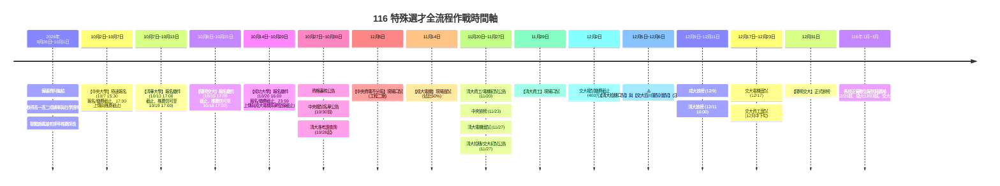

# 116 學年度大學特殊選才：重要日程時間軸與繳交資料全景總彙整

> **資料依據**：
> - [國立中央大學 116 特殊選才簡章](file:///C:/Users/yehya/Documents/GitHub/yangfu-application/00_source_materials/簡章與說明會/116特殊選才簡章_中央大學.pdf)
> - [國立清華大學 116 特殊選才（拾穗計畫）簡章](file:///C:/Users/yehya/Documents/GitHub/yangfu-application/00_source_materials/簡章與說明會/116特殊選才簡章_清華大學.pdf)
> - [國立陽明交通大學 116 特殊選才簡章](file:///C:/Users/yehya/Documents/GitHub/yangfu-application/00_source_materials/簡章與說明會/116特殊選才簡章_交通大學.pdf)
> - [國立成功大學 116 特殊選才簡章](file:///C:/Users/yehya/Documents/GitHub/yangfu-application/00_source_materials/簡章與說明會/116特殊選才簡章_成功大學.pdf)
> - [國立臺灣師範大學 116 特殊選才簡章](file:///C:/Users/yehya/Documents/GitHub/yangfu-application/00_source_materials/簡章與說明會/116學年度台師大特殊選才招生簡章.pdf)

---

## 一、跨校關鍵時程全景時間軸 (Chronological Timeline)

---

## 二、各大學官方重要日程對照總表

> [!CAUTION]
> **各大校「截止時間」各有不同規範，非一律為午夜 23:59！**
> - **中央大學**：10/7 **15:30 繳費與報名截止**、**17:00 上傳與推薦函截止**。
> - **清華大學**：10/13 **17:00 報名、繳費與資料上傳截止**（推薦函寬限至 10/19 17:00）。
> - **陽明交大**：10/15 **17:00 報名、繳費與資料上傳截止**（推薦函寬限至 10/16 17:00）。
> - **成功大學**：10/20 **16:00 報名與繳費截止**（臨櫃至 15:30），**23:59 上傳與系網填表截止**。

| 學校 | 網路報名與繳費期間 | 資料上傳截止時間 | 推薦函填寫截止 | 准考證／資格查詢 | 複試（面試／口試）日期 | 放榜日期 | 正取生報到截止 |
| :--- | :--- | :--- | :--- | :--- | :--- | :--- | :--- |
| **國立中央大學** ([簡章](file:///C:/Users/yehya/Documents/GitHub/yangfu-application/00_source_materials/簡章與說明會/116特殊選才簡章_中央大學.pdf)) | **10/02(五) 09:00 ～ 10/07(三) 15:30** | **10/07(三) 17:00** （系統鎖定） | **10/07(三) 17:00** （線上填寫） | 10/27(二) 資格公告 10/30(五)前 複試名單 | **資電不分系：11/05(四)** （中央工程二館） | **11/23(一)** | 12/01(二) ～ 12/10(四) |
| **國立清華大學** ([簡章](file:///C:/Users/yehya/Documents/GitHub/yangfu-application/00_source_materials/簡章與說明會/116特殊選才簡章_清華大學.pdf)) | **10/07(三) 10:00 ～ 10/13(二) 17:00** | **10/13(二) 17:00** （逾期不受理） | **10/19(一) 17:00** （系統填寫） | 10/28(三)起 查詢編號 11/20(五) 電機/資工初審 11/27(五) 拾穗初審 | **電機系：11/27(五)** **資工系：11/29(日)** **拾穗：12/05(六)或06(日)** | **12/11(五) 10:00** | 12/21(一) 前 回覆就讀意願 |
| **國立陽明交通大學** ([簡章](file:///C:/Users/yehya/Documents/GitHub/yangfu-application/00_source_materials/簡章與說明會/116特殊選才簡章_交通大學.pdf)) | **10/08(四) 09:00 ～ 10/15(四) 17:00** | **10/15(四) 17:00** （逾期無法補件） | **10/16(五) 17:00** （線上填寫） | 10/22(四) 15:00 查詢狀態 11/27(五) 初試結果公告 12/02(三) 複試繳費截止 | **百川學程：12/05(六)**（筆試/口試） **電機系：12/17(四)** **資工系：12/15公告後應試** | **12/31(四) 09:00** | 115/12/31 ～ 116/01/08(五) |
| **國立成功大學** ([簡章](file:///C:/Users/yehya/Documents/GitHub/yangfu-application/00_source_materials/簡章與說明會/116特殊選才簡章_成功大學.pdf)) | **10/14(三) 09:00 ～ 10/20(二) 16:00** （臨櫃至15:30） | **10/20(二) 23:59** ⚠️ 電機系網登錄同步截止 | 併於審查資料中 （或無硬性要求） | 11/11(三) 16:00 准考證 11/07前後 公告面試名單 | **電機系：11/14(六)** （成大電機系館） | **12/09(三)** | 12/23(三) 23:59 止 （線上報到） |
| **國立臺灣師範大學** ([簡章](file:///C:/Users/yehya/Documents/GitHub/yangfu-application/00_source_materials/簡章與說明會/116學年度台師大特殊選才招生簡章.pdf)) | 09/29(二) 09:00 ～ 10/07(三) 17:00 | 10/08(四) 17:00 | 依各系所規定 | 10/30(五) 准考證列印 | 10/31(六) ～ 11/20(五) （依學系規定） | 12/03(四) 09:00 | 12/03(四) ～ 12/16(三) |

---

## 三、各校學系「繳交資料」與「規格限制」檢核矩陣

### 1. 自傳與讀書計畫篇幅限制對照表（嚴禁超頁超字）

| 目標校系 | 自傳規定與上限 | 讀書計畫／學習計畫規定 | 格式特殊要求 |
| :--- | :--- | :--- | :--- |
| **陽明交大 百川學程** | **實體紙張純手寫，限 1000 字內** | 參照專業核心課程擬訂修課藍圖（建議 A4 三頁內） | 需於實體紙張書寫近 5 年歷程後掃描為 PDF 上傳 |
| **陽明交大 資工系** | 自述個人特殊專長表現，**篇幅至多 2 頁** | 含申請動機，**篇幅至多 2 頁** | 須下載填寫綜合組「個人資料表」 |
| **陽明交大 電機系** | 自述特殊專長表現（篇幅精簡） | 含申請動機 | 實作可製作影片上傳 YouTube 並附連結 |
| **清華大學 清華學院 (拾穗)** | 自傳含個人成長、讀書計畫、申請動機，**4 頁 A4 為限** | 併於自傳 4 頁內或獨立陳述 | 中英文皆可，超過 4 頁不予審查 |
| **清華大學 資工系** | 中文自傳（含成長歷程、讀書計畫、申請動機） | 併於自傳內呈現完整脈絡 | 著重資訊天分、實作成果與程式能力 |
| **清華大學 電機系** | 中文自傳（含個人成長、申請動機、讀書計畫），**8 頁以內** | 併於 8 頁內呈現完整規劃 | 中英文皆可，須以小括弧標註對應報名資格條款 |
| **成功大學 電機系** | 自傳及申請動機，**限 2000 字以內** | 包含於 2000 字自傳或成果說明內 | ⚠️ **各項檔案限 PDF，每項檔案上限 5MB** |
| **中央大學 資電不分系** | 自傳（整併於學系審查 PDF） | 讀書計畫含申請動機（整併於學系審查 PDF） | 兩份 PDF（資格審查、學系審查），單檔建議 < 20MB |

---

### 2. 各系指定繳交審查文件清單

#### 國立中央大學（資訊電機學院學士班）
1. **報名資格審查資料（單一 PDF）**：
   - 網路報名表（貼妥相片、身分證正反面影本、考生簽名）。
   - 學歷證明：高三在學證明書（教務處核章）。
2. **學系審查資料（單一 PDF，< 20MB）**：
   - 高中歷年成績單正本（含各學期班排、校排百分比）。
   - 自傳及讀書計畫（含申請動機）。
   - 足資證明資訊或電機專長之成果（競賽獎狀、APCS、專題報告）。
   - 其他有利審查資料（全民英檢、多益證書、活動表現等）。
3. **推薦信**：1 至 2 封，於報名系統發送邀請，由推薦人於 10/7 17:00 前線上填寫完成。

#### 國立清華大學（清華學院學士班／資工系／電機系）
1. **共通基本表件**：
   - 高中在校成績單（含班級、班群、年級名次證明至少一種）。
   - 在學證明或學生證影本。
2. **清華學院學士班（拾穗計畫）專屬**：
   - 自傳（含成長歷程、讀書計畫、申請動機，**A4 限 4 頁以內**）。
   - 推薦函 2 封（一封由校長/主任/師長推薦，一封由相關人士推薦，10/19 17:00 前線上完成）。
   - 其他有利申請資料（**限 10 頁以內，合併單一檔上限 10MB**）。
3. **電機工程學系專屬**：
   - 中文自傳（含成長歷程、申請動機、讀書計畫，**8 頁以內**）。
   - 推薦函 2 封（簡章格式，線上填寫）。
   - 其他有利資料（競賽、專題、語文等）。
4. **資訊工程學系專屬**：
   - 中文自傳（含成長歷程、讀書計畫、申請動機）。
   - 推薦函 2 封（線上填寫）。
   - 特殊才能證明（APCS、競賽獎狀、GitHub 作品集等）。

#### 國立陽明交通大學（百川學程／資工系／電機系）
1. **共通基本表件**：
   - 高中在校成績單彩色掃描檔。
   - 在學證明影本。
2. **百川學士學位學程專屬**：
   - 操行表現或相關獎懲證明（含師長評語描述）。
   - **自傳：實體紙張手寫近 5 年學習歷程與特殊表現，限 1000 字內掃描上傳**。
   - **學習計畫：擬訂修課藍圖（依百川規定專業核心課程擇一撰寫）**。
   - 推薦函 2 封（系統發送連結，10/16 17:00 前線上完成）。
   - 其他經歷證明（可附 YouTube 影片連結）。
3. **資訊工程學系專屬**：
   - 個人資料表（至交大綜合組網站下載）。
   - 自傳（**篇幅至多 2 頁**）。
   - 讀書計畫含申請動機（**篇幅至多 2 頁**）。
   - 推薦函 1 至 2 封（由推薦人於資工系招生系統直接填寫）。
   - 資訊專長證明（競賽獲獎、APCS 級分證明等）。
4. **電機工程學系專屬**：
   - 自傳與讀書計畫（含動機）。
   - 推薦函 2 封（線上填寫）。
   - 電機領域專長證明（實作報告、競賽等，可附 YouTube 連結）。

#### 國立成功大學（電機工程學系）
1. **審查資料上傳（成大報名系統，限 PDF，每項上限 5MB）**：
   - 網路報名審核表（系統下載簽名後上傳）。
   - 高中歷年成績單（含在校排名證明）。
   - **自傳及申請動機（限 2000 字以內）**。
   - **競賽成果證明（關鍵要求：三人團隊作品須檢附指導老師核章簽名之《分工與貢獻百分比證明書》）**。
   - 其他有利審查資料（全民英檢中高級、APCS 成績、旺宏/育秀盃/扶輪盃等）。
2. **⚠️ 電機系專屬硬性規定（務必執行）**：
   - 審查資料上傳後，必須於 **10/20 23:59 前至「成大電機系官網（https://www.ee.ncku.edu.tw）」填報個人資料表**。

---

## 四、考生衝堂風險與關鍵因應策略

> [!WARNING]
> **重大考程衝堂預警**
> - **12月5日(六) ～ 12月6日(日)**：
>   - **清華大學 清華學院（拾穗計畫）口試**：12/5 或 12/6 擇一日辦理。
>   - **陽明交通大學 百川學士學位學程筆試／口試**：預定於 12/5 舉行。
>   - **因應方案**：兩校皆在新竹，車程僅 10~15 分鐘。若兩校皆通過初審，須於 **11/27 初選公告第一時間**主動聯絡兩系試務組，協調錯開上午與下午口試場次！
> - **11月27日(五)**：**清華大學 電機系面試**（此日交大百川公告初審，無口試衝突）。
> - **11月29日(日)**：**清華大學 資工系口試**（無其他校面試衝突）。
> - **11月14日(六)**：**成大電機現場面試**（當週專心赴台南應考，無衝堂）。
> - **11月05日(四)**：**中央資電不分系口試**（全台最早口試，作為極佳的前哨戰）。

---

## 五、分階段具體行動方針 (Action Checklist)

### 階段一：黃金備戰期（即日起 ～ 10月1日）
- [ ] 依各校字數/頁數限制，輸出各版本自傳與計畫：
  - [ ] **百川手寫版**：依 998 字母稿完成實體 A4 手寫並高清掃描。
  - [ ] **成大電機版**：濃縮自傳與動機在 2000 字內。
  - [ ] **交大資工版**：自傳 2 頁內、讀書計畫 2 頁內。
  - [ ] **清大拾穗版**：整合自傳與計畫在 A4 4 頁內。
- [ ] 聯繫指導老師（趙義雄老師）與班導師，備妥各校推薦信草稿，確認師長 10/2~10/19 間之收信 Email。
- [ ] 請趙義雄老師簽署《競賽團隊分工與申請人貢獻百分比說明書》（成大電機必備）。
- [ ] 向花蓮高中教務處申請並核章「高一高二歷年成績單（含班排/校排百分比證明）」與「在學證明書」多份。

### 階段二：十月極速報名上傳週（10月2日 ～ 10月20日）
- [ ] **10/02(五)**：【中央大學】系統開放，登錄基本資料、上傳證件照，**立即送出推薦信邀請**並完成 800 元繳費。
- [ ] **10/07(三) 15:30 前**：確認中央大學繳費完成；**17:00 前完成中央兩份 PDF 上傳**並追蹤推薦信送出。
- [ ] **10/07(三)**：【清華大學】系統開放，登錄報名並取得推薦信系統序號。
- [ ] **10/08(四)**：【陽明交大】系統開放，登錄報名並發送線上推薦信通知信。
- [ ] **10/13(二) 17:00 前**：【清華大學】完成報名、繳費與指定資料 PDF 上傳。
- [ ] **10/14(三)**：【成功大學】系統開放，登錄報名基本資料。
- [ ] **10/15(四) 17:00 前**：【陽明交大】完成檔案上傳與繳費。
- [ ] **10/16(五) 17:00 前**：確認陽明交大師長推薦函全數填妥。
- [ ] **10/19(一) 17:00 前**：確認清華大學師長推薦函全數填妥。
- [ ] **10/20(二) 16:00 前**：【成功大學】完成報名登錄與 800 元繳費。
- [ ] **10/20(二) 23:59 前**：【成功大學】各項審查 PDF（< 5MB）上傳完畢，**並至成大電機系官網填寫「個人資料表」**。

### 階段三：應試與複試期（11月 ～ 12月）
- [ ] **10/30 前**：查詢中央資電口試時段，前往中央工程二館應考（11/05）。
- [ ] **11/11 起**：列印成大電機准考證，前往成大電機系館應試（11/14）。
- [ ] **11/20 & 11/27**：查詢清大與交大初審公告，若遇清大拾穗與交大百川衝堂立即協調時間。
- [ ] **11/27、11/29、12/05、12/17**：按排定時程準時赴新竹應試清大與交大各學系。
